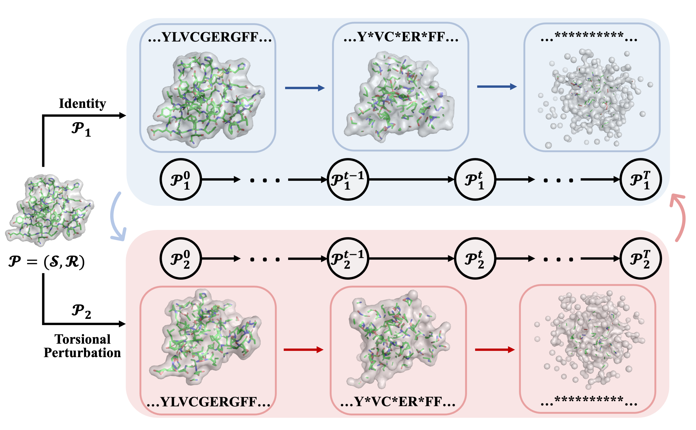

# SiamDiff: Siamese Diffusion Trajectory Prediction


This is the official codebase of the paper

**Pre-Training Protein Encoder via Siamese Sequence-Structure Diffusion Trajectory Prediction**
[[ArXiv](https://arxiv.org/abs/2301.12068)]

[Zuobai Zhang*](https://oxer11.github.io/), [Minghao Xu*](https://chrisallenming.github.io/), [Aurelie Lozano](https://researcher.watson.ibm.com/researcher/view.php?person=us-aclozano), [Vijil Chenthamarakshan](https://researcher.watson.ibm.com/researcher/view.php?person=us-ecvijil), [Payel Das](https://researcher.watson.ibm.com/researcher/view.php?person=us-daspa), [Jian Tang](https://jian-tang.com/)

## Overview

*Siamese Diffusion Trajectory Prediction (**SiamDiff**)* is a diffusion-based pre-training algorithm for protein structure encoders.
The method performs diffusion on both protein sequences and structures and learn effective representations based on mutual denoising between two siamese diffusion trajectories.
It achieves large improvements on a diverse set of downstream tasks, including function annotation, protein-protein interaction prediction, mutational effect prediction, residue structural role modeling, and protein structure ranking.
Among all existing pre-training algorithms, SiamDiff is the only one that can consistently deliever large improvments on all the tasks.



This codebase is based on PyTorch and [TorchDrug] ([TorchProtein](https://torchprotein.ai)). 
It supports training and inference with multiple GPUs.
The basic implementation of GearNet and datasets can be found in the [docs](https://torchdrug.ai/docs/) of TorchDrug and the step-by-step [tutorials](https://torchprotein.ai/tutorials) in TorchProtein.

[TorchDrug]: https://github.com/DeepGraphLearning/torchdrug

## Installation

You may install the dependencies via either conda or pip. Generally, SiamDiff works
with Python 3.7/3.8 and PyTorch version >= 1.8.0.

### From Conda

```bash
conda install torchdrug pytorch=1.8.0 cudatoolkit=11.1 -c milagraph -c pytorch-lts -c pyg -c conda-forge
conda install easydict pyyaml -c conda-forge
pip install atom3d
```

### From Pip

```bash
pip install torch==1.8.0+cu111 -f https://download.pytorch.org/whl/lts/1.8/torch_lts.html
pip install torchdrug
pip install easydict pyyaml atom3d
```


## Reproduction

### Training From Scratch

To reproduce the results of GearNet-Edge on Atom3D and EC prediction, use the following command. 
All the datasets except PIP will be automatically downloaded in the code.
It takes longer time to run the code for the first time due to the preprocessing time of the dataset.

```bash
# Run GearNet-Edge on the MSP dataset with 1 gpu
python script/run_1gpu.py -c config/atom/msp_gearnet.yaml

# Run GearNet-Edge on the PSR dataset with 1 gpu
python script/run_1gpu.py -c config/atom/psr_gearnet.yaml

# First download and unzip the preprocessed PIP dataset from Atom3D,
# Then run GearNet-Edge on the dataset with 1 gpu
wget https://zenodo.org/record/4911102/files/PPI-DIPS-split.tar.gz -P ~/scratch/protein-datasets/PPI-DIPS-split/
tar -zxvf ~/scratch/protein-datasets/PPI-DIPS-split/PPI-DIPS-split.tar.gz -C ~/scratch/protein-datasets/PPI-DIPS-split/
python script/run_1gpu.py -c config/atom/pip_gearnet.yaml

# Since the RES dataset is large, we run GearNet-Edge with 4 gpus
python -m torch.distributed.launch --nproc_per_node=4 script/run_4gpu.py -c config/atom/res_gearnet.yaml
```

Besides atom-level tasks, we also provide residue-level evaluation on MSP, PSR and EC datasets. All these models are run with 4 gpus.
```bash
python -m torch.distributed.launch --nproc_per_node=4 script/run_4gpu.py -c config/res/msp_gearnet.yaml

python -m torch.distributed.launch --nproc_per_node=4 script/run_4gpu.py -c config/res/psr_gearnet.yaml

python -m torch.distributed.launch --nproc_per_node=4 script/run_4gpu.py -c config/res/ec_gearnet.yaml
```

### Pre-training and Fine-tuning
By default, we will use the AlphaFold Database for pretraining.
To pretrain GearNet-Edge with SiamDiff, use the following command. 
Similar, all the datasets will be automatically downloaded in the code and preprocessed for the first time you run the code.

The pre-training is divided into two stages: large noise stage and small noise stage.
```bash
# The first-stage pre-training with SiamDiff
python -m torch.distributed.launch --nproc_per_node=4 script/pretrain.py -c config/pretrain/gearnet_1st.yaml

# The second-stage pre-training with SiamDiff
# <path_to_ckpt> is the path to the checkpoint from the first-stage pre-training
python -m torch.distributed.launch --nproc_per_node=4 script/pretrain.py -c config/pretrain/gearnet_2st.yaml --ckpt <path_to_ckpt>
```

After pretraining, you can load the model weight from the saved checkpoint via the `--ckpt` argument and then fine-tune the model on downstream tasks.

```bash
# Fine-tune the pre-trained model on the PIP dataset
# <path_to_ckpt> is the path to the checkpoint after two-stage pre-training
python script/run_1gpu.py -c config/atom/pip_gearnet.yaml --ckpt <path_to_ckpt>
```

Similar commands can be used for residue-level pre-training.
```bash
# Two-stage pre-training with SiamDiff
python -m torch.distributed.launch --nproc_per_node=4 script/pretrain.py -c config/pretrain/res_gearnet_1st.yaml

python -m torch.distributed.launch --nproc_per_node=4 script/pretrain.py -c config/pretrain/res_gearnet_2st.yaml --ckpt <path_to_ckpt>

# Fine-tune the pre-trained model on the EC dataset
python -m torch.distributed.launch --nproc_per_node=4 script/run_4gpu.py -c config/res/ec_gearnet.yaml --ckpt <path_to_ckpt>
```

You provide the two-stage pre-trained model weights as below.

| Model | Config | Ckpt |
| ---- | :----: | :----: |
| GearNet-Edge (atom) | [config1](./config/pretrain/gearnet_1st.yaml), [config2](./config/pretrain/gearnet_2nd.yaml) | [ckpt](https://www.dropbox.com/scl/fi/hvtmqqfr6bvz8y2wrdrph/siamdiff_gearnet_res.pth?rlkey=daeanrcqk9b0erw9ot04932c6&dl=0) |
| GearNet-Edge (residue) | [config1](./config/pretrain/res_gearnet_1st.yaml), [config2](./config/pretrain/res_gearnet_2nd.yaml) | [ckpt](https://www.dropbox.com/scl/fi/njhq7lqrdn2bnvk0wxwz2/siamdiff_gearnet_atom.pth?rlkey=h78tif5a0pwq6mmw7atp7962v&dl=0) |

We provide the hyperparameters for each experiment in configuration files.
All the configuration files can be found in `config/*.yaml`.
We list some important configuration hyperparameters here:
| Config | Meaning |
| :---- | :---- |
| engine.gpus | which gpu(s) to use for training; if set to `null`, use cpu instead |
| engine.batch_size | the batch size for training on each gpu |
| train.train_time | the maximum time for training per epoch |
| train.val_time | the maximum time for validation per epoch |
| train.test_time | the maximum time for testing per epoch |
| model_checkpoint | the path to a model checkpoint |
| save_interval | save the pre-trained model every `save_interval` epochs |
| save_model | whether to save the model (encoder) for downstream tasks or save the task (encoder + prediction head) for next-stage pre-training ; if `True`, save the model; otherwise, save the task |
| task.SiamDiff.use_MI | whether to use mutual information maximization; if `True`, use SiamDiff; otherwise, use DiffPreT |

Details of model hyperparameters can be found in the docstring.

## Results
Here are the results of GearNet-Edge on all benchmark tasks.
**It should be noted that since PSR and MSP datasets are quite small, they typcically have large variances for their results. So we cannot guarantee the absolute performance can be consistently achieved on different machines. But the improvements of pre-training with SiamDiff over un-pretrained models should be observable.**
The performance on downstream tasks are very sensitive to hyperparameters, so please carefully follow our configs for reproduction.
More detailed results are listed in the paper.


## Citation
If you find this codebase useful in your research, please cite the following paper.

```bibtex
@article{zhang2023siamdiff,
  title={Protein Encoder Pre-Training via Siamese Sequence-Structure Diffusion Trajectory Prediction},
  author={Zhang, Zuobai* and Xu, Minghao* and Lozano, Aur{\'e}lie and Chenthamarakshan, Vijil and Das, Payel and Tang, Jian},
  journal={arXiv preprint arXiv:2301.12068},
  year={2023}
}
```
